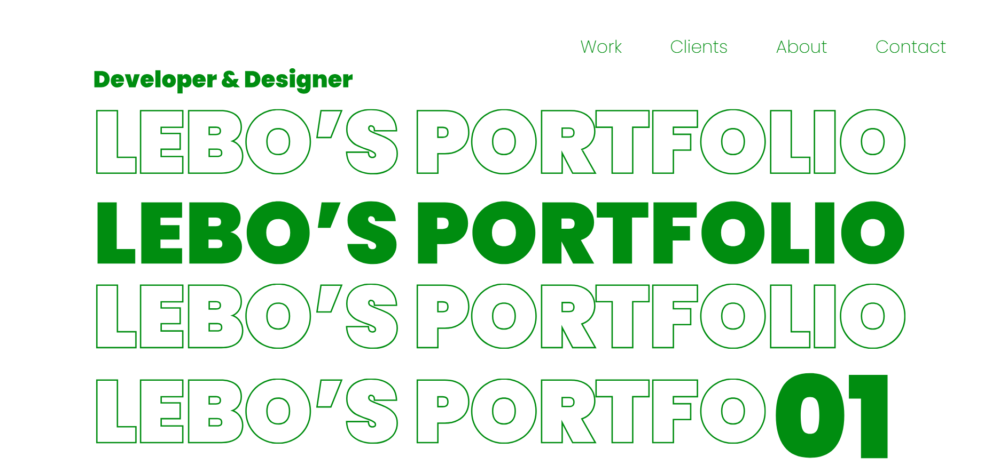
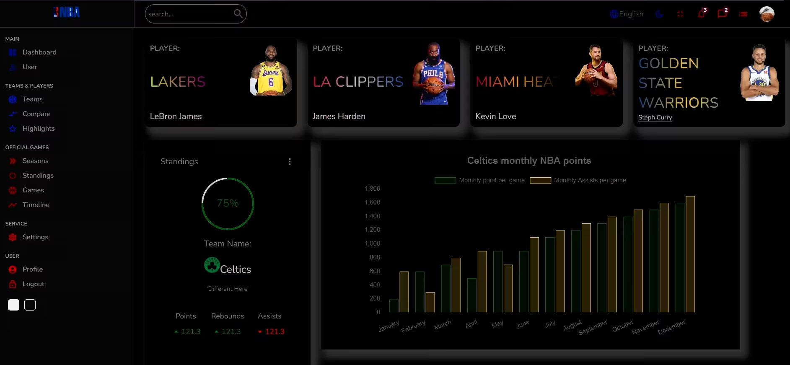
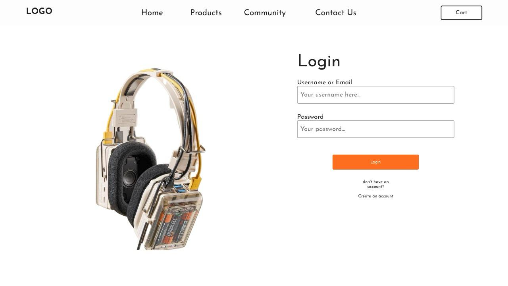
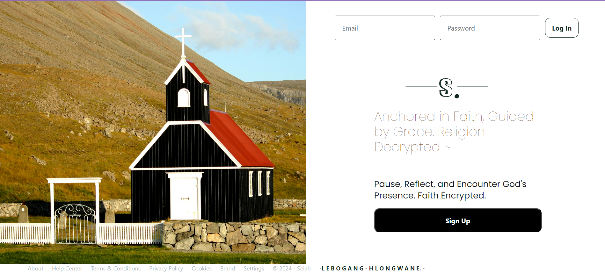
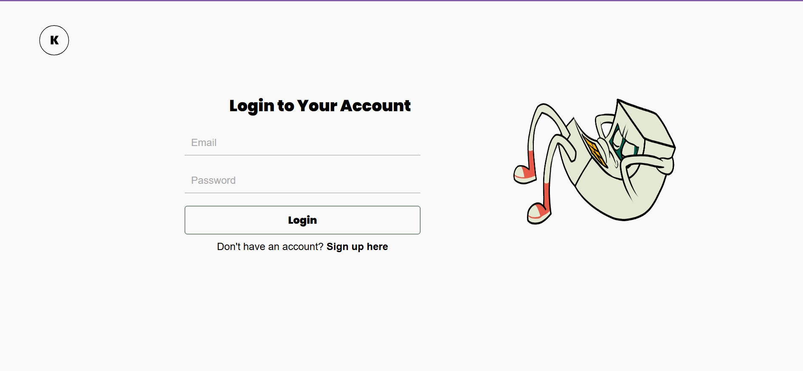

<!-- Level 3: Add custom code -->

# 👋 Hi, I'm Brilu also known as Lebogang!

👩🏻‍💻 Web Developer sharing about my journey and learnings in tech 
👩🏻‍🎓 Currently studing Creative Technology at the Open Window Institute, Centurion , South Africa 
💭 Currently learning about cyber Security [digital garden](https://www.coursera.org/professional-certificates/google-cybersecurity) 

<!-- GitHub stats from https://github.com/anuraghazra/github-readme-stats -->

 

# 💻 Tech Stack

<!-- Badges from https://github.com/Ileriayo/markdown-badges -->

# 💻 Projects

[NBA Github Link](https://github.com/Brilu-22/newapp.git)
[EQ Github Link](https://github.com/KurtSchwimmbacher/DV200T2GroupAssignment.git)
[Selah Github Link](https://github.com/Brilu-22/Php_Project.git)
[Khanyisa Github Link](https://github.com/Brilu-22/City.git)
